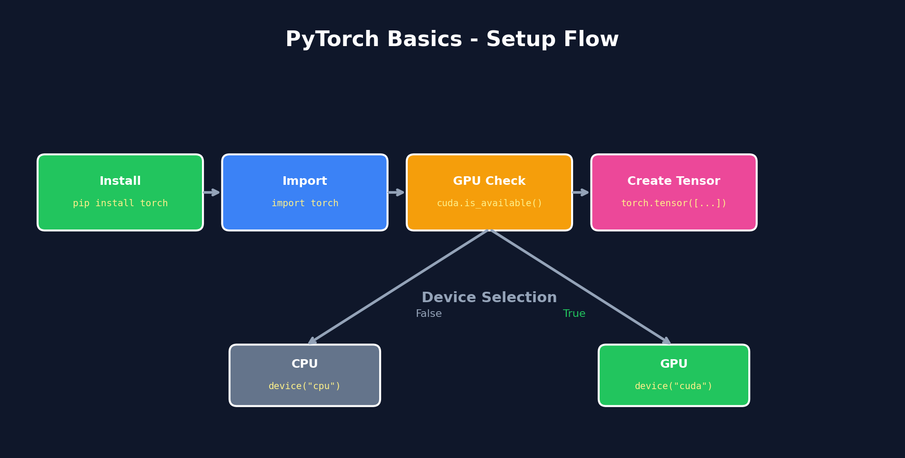

<h1 align="center">01. PyTorch Basics</h1>

<p align="center">
  
  
</p>

<p align="center">
  <a href="../README.md">← Back</a> &nbsp;•&nbsp;
  <a href="../02_tensors/README.md">Next: Tensors →</a>
</p>

<p align="center">
  <a href="https://colab.research.google.com/github/gaurav-redhat/pytorch_tutorial/blob/main/01_basics/demo.ipynb">
    
  </a>
</p>

---

## Overview

<p align="center">
  
</p>

---

## What You'll Learn

| Topic | Description |
|-------|-------------|
| Installation | Install PyTorch (CPU/GPU) |
| Import | Import and check version |
| GPU Check | Verify CUDA availability |
| First Tensor | Create your first tensor |

---

## Installation

```bash
# CPU only
pip install torch torchvision

# With CUDA (GPU)
pip install torch torchvision --index-url https://download.pytorch.org/whl/cu118
```

---

## Your First Code

```python
import torch

# Check version
print(f"PyTorch: {torch.__version__}")

# Check GPU
print(f"CUDA: {torch.cuda.is_available()}")

# First tensor
x = torch.tensor([1, 2, 3, 4, 5])
print(f"Tensor: {x}")
print(f"Shape: {x.shape}")
print(f"Dtype: {x.dtype}")
```

---

## Key Concepts

**PyTorch** = Deep learning framework with dynamic graphs and GPU support

**Tensor** = Multi-dimensional array that runs on GPU and supports autograd

---

## Checklist

- [ ] Install PyTorch
- [ ] Import torch
- [ ] Check CUDA
- [ ] Create tensor

---

<p align="center">
  <a href="https://colab.research.google.com/github/gaurav-redhat/pytorch_tutorial/blob/main/01_basics/demo.ipynb">
    
  </a>
</p>

<p align="center">
  <a href="../README.md">← Back to Main</a> &nbsp;•&nbsp;
  <a href="../02_tensors/README.md">Next: Tensors →</a>
</p>
