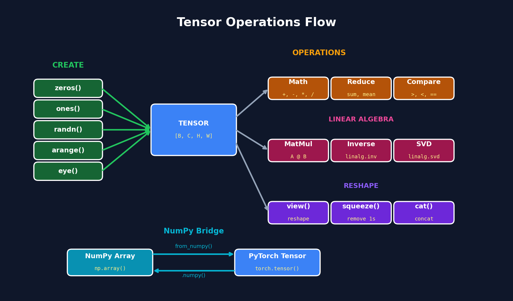

<h1 align="center">02. Tensors</h1>

<p align="center">
  
  
</p>

<p align="center">
  <a href="../01_basics/README.md">← Prev: Basics</a> &nbsp;•&nbsp;
  <a href="../README.md">Home</a> &nbsp;•&nbsp;
  <a href="../03_autograd/README.md">Next: Autograd →</a>
</p>

<p align="center">
  <a href="https://colab.research.google.com/github/gaurav-redhat/pytorch_tutorial/blob/main/02_tensors/demo.ipynb">
    
  </a>
</p>

---

## Overview

<p align="center">
  
</p>

---

## What You'll Learn

| Topic | Description |
|-------|-------------|
| Creation | zeros, ones, randn, arange, eye |
| NumPy Bridge | from_numpy, .numpy() |
| Operations | Math, comparison, reduction |
| Linear Algebra | matmul, inverse, SVD, solve |
| Reshape | view, squeeze, cat, stack |

---

## Tensor Creation

```python
import torch

# Basic creation
torch.zeros(3, 4)       # 3x4 zeros
torch.ones(2, 3)        # 2x3 ones
torch.randn(3, 3)       # Random normal
torch.arange(0, 10)     # [0, 1, ..., 9]
torch.eye(3)            # Identity matrix
```

---

## NumPy Bridge

```python
import numpy as np

# NumPy → PyTorch (shares memory)
arr = np.array([1, 2, 3])
tensor = torch.from_numpy(arr)

# PyTorch → NumPy
tensor = torch.tensor([1, 2, 3])
arr = tensor.numpy()
```

---

## Operations

```python
a = torch.tensor([1., 2., 3.])
b = torch.tensor([4., 5., 6.])

# Arithmetic
a + b, a - b, a * b, a / b

# Reduction
a.sum(), a.mean(), a.max()

# Linear algebra
A @ B              # Matrix multiply
torch.linalg.inv(A)   # Inverse
torch.linalg.svd(A)   # SVD
```

---

## Reshape

```python
x = torch.arange(12)

x.view(3, 4)       # Reshape
x.squeeze()        # Remove dim=1
x.unsqueeze(0)     # Add dim
torch.cat([a, b])  # Concatenate
torch.stack([a, b]) # Stack (new dim)
```

---

## Checklist

- [ ] Create tensors (zeros, randn, etc.)
- [ ] Convert NumPy ↔ PyTorch
- [ ] Basic operations
- [ ] Linear algebra (matmul, SVD)
- [ ] Reshape tensors

---

<p align="center">
  <a href="https://colab.research.google.com/github/gaurav-redhat/pytorch_tutorial/blob/main/02_tensors/demo.ipynb">
    
  </a>
</p>

<p align="center">
  <a href="../01_basics/README.md">← Prev: Basics</a> &nbsp;•&nbsp;
  <a href="../README.md">Back to Main</a> &nbsp;•&nbsp;
  <a href="../03_autograd/README.md">Next: Autograd →</a>
</p>
