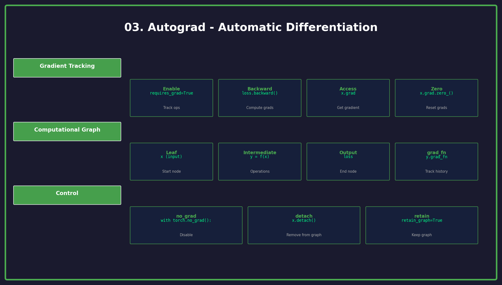

<p align="center">
  
  
  
</p>

<h1 align="center">03. Autograd</h1>

<p align="center">
  <a href="../README.md">← Back</a> •
  <a href="../02_tensors/README.md">← Prev</a> •
  <a href="../04_neural_networks/README.md">Next: Neural Networks →</a>
</p>

<p align="center">
  <a href="https://colab.research.google.com/github/gaurav-redhat/pytorch_tutorial/blob/main/03_autograd/demo.ipynb">
    
  </a>
</p>

---

<p align="center">
  
</p>

---

## 🎯 What You'll Learn

| Topic | Description |
|-------|-------------|
| requires_grad | Track operations for gradients |
| backward() | Compute gradients automatically |
| Computational Graph | How PyTorch tracks operations |
| no_grad() | Disable gradient tracking |

---

## 💡 What is Autograd?

Autograd = **automatic differentiation**. It computes gradients for you.

```
Forward:   x → y = f(x) → loss = g(y)
Backward:  ∂loss/∂x ← ∂loss/∂y ← ∂loss/∂loss
```

This is how neural networks learn!

---

## 🔄 Basic Example

```python
import torch

# Create tensor with gradient tracking
x = torch.tensor([2.0], requires_grad=True)

# Forward pass
y = x ** 2      # y = x²
z = 2 * y + 3   # z = 2x² + 3

# Backward pass (compute gradients)
z.backward()

# Check gradient
print(x.grad)   # dz/dx = 4x = 8
```

---

## 📊 Computational Graph

```
x (leaf, requires_grad=True)
    │
    ▼  (x ** 2)
    y
    │
    ▼  (2 * y + 3)
    z (output)
```

- **Leaf nodes**: Input tensors
- **Non-leaf nodes**: Intermediate results
- `backward()` traces this graph in reverse

---

## 🚫 Disabling Gradients

```python
# For inference (no training)
with torch.no_grad():
    y = model(x)
    # No gradient computation here

# Detach from graph
x_detached = x.detach()

# Globally disable
torch.set_grad_enabled(False)
```

---

## 🔥 Real Training Example

```python
# Parameters
w = torch.tensor([1.0], requires_grad=True)
b = torch.tensor([0.0], requires_grad=True)

# Data
x = torch.tensor([1.0, 2.0, 3.0])
y_true = torch.tensor([2.0, 4.0, 6.0])

# Forward
y_pred = w * x + b
loss = ((y_pred - y_true) ** 2).mean()

# Backward
loss.backward()

# Gradients
print(f"w.grad: {w.grad}")  # dL/dw
print(f"b.grad: {b.grad}")  # dL/db

# Update (gradient descent)
with torch.no_grad():
    w -= 0.1 * w.grad
    b -= 0.1 * b.grad
```

---

## ⚠️ Important Notes

| Rule | Why |
|------|-----|
| `grad` accumulates | Call `zero_grad()` before each backward |
| In-place ops | Avoid on tensors with `requires_grad=True` |
| `backward()` once | Call only once per graph (by default) |

```python
# Zero gradients before backward
optimizer.zero_grad()
loss.backward()
optimizer.step()
```

---

## ✅ Checklist

- [ ] Create tensor with requires_grad=True
- [ ] Call backward() to compute gradients
- [ ] Access gradients with .grad
- [ ] Use no_grad() for inference

---

<p align="center">
  <a href="https://colab.research.google.com/github/gaurav-redhat/pytorch_tutorial/blob/main/03_autograd/demo.ipynb">
    
  </a>
</p>

