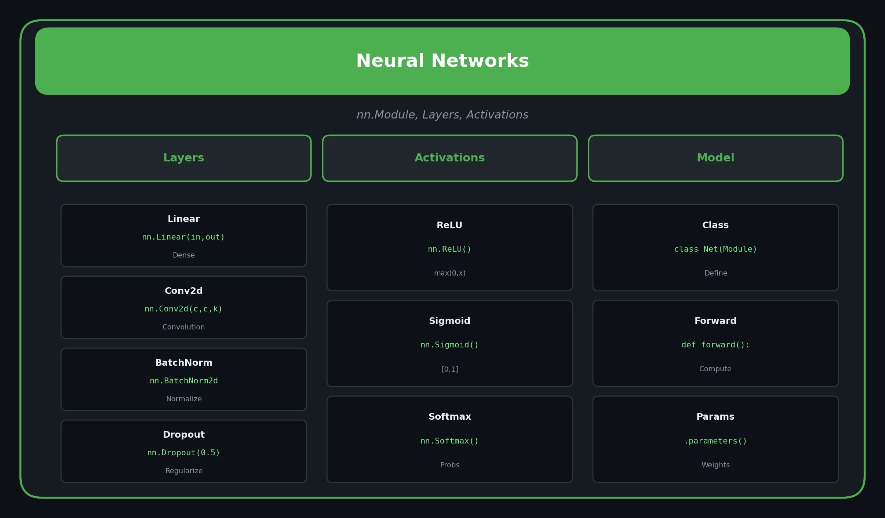

<p align="center">
  
  
  
</p>

<h1 align="center">04. Neural Networks</h1>

<p align="center">
  <a href="../README.md">← Back</a> •
  <a href="../03_autograd/README.md">← Prev</a> •
  <a href="../05_data_loading/README.md">Next: Data Loading →</a>
</p>

<p align="center">
  <a href="https://colab.research.google.com/github/gaurav-redhat/pytorch_tutorial/blob/main/04_neural_networks/demo.ipynb">
    
  </a>
</p>

---

<p align="center">
  
</p>

---

## 🎯 What You'll Learn

| Topic | Description |
|-------|-------------|
| nn.Module | Base class for all models |
| Layers | Linear, Conv2d, ReLU, etc. |
| forward() | Define the computation |
| Parameters | model.parameters() |

---

## 🏗️ Your First Neural Network

```python
import torch
import torch.nn as nn

class SimpleNet(nn.Module):
    def __init__(self):
        super().__init__()
        self.fc1 = nn.Linear(784, 128)  # Input → Hidden
        self.fc2 = nn.Linear(128, 10)   # Hidden → Output
        self.relu = nn.ReLU()
    
    def forward(self, x):
        x = self.relu(self.fc1(x))
        x = self.fc2(x)
        return x

# Create model
model = SimpleNet()
print(model)
```

---

## 📦 Common Layers

| Layer | Description | Example |
|-------|-------------|---------|
| `nn.Linear` | Fully connected | `nn.Linear(in, out)` |
| `nn.Conv2d` | 2D convolution | `nn.Conv2d(in, out, 3)` |
| `nn.ReLU` | Activation | `nn.ReLU()` |
| `nn.Dropout` | Regularization | `nn.Dropout(0.5)` |
| `nn.BatchNorm1d` | Normalization | `nn.BatchNorm1d(features)` |

---

## 🎯 Using nn.Sequential

```python
# Quick way to build models
model = nn.Sequential(
    nn.Linear(784, 256),
    nn.ReLU(),
    nn.Dropout(0.2),
    nn.Linear(256, 128),
    nn.ReLU(),
    nn.Linear(128, 10)
)

# Forward pass
x = torch.randn(32, 784)  # Batch of 32
output = model(x)         # Shape: [32, 10]
```

---

## 🔧 Accessing Parameters

```python
# All parameters
for name, param in model.named_parameters():
    print(f"{name}: {param.shape}")

# Count parameters
total = sum(p.numel() for p in model.parameters())
print(f"Total parameters: {total}")

# Trainable only
trainable = sum(p.numel() for p in model.parameters() if p.requires_grad)
```

---

## 💾 Save & Load

```python
# Save
torch.save(model.state_dict(), 'model.pth')

# Load
model = SimpleNet()
model.load_state_dict(torch.load('model.pth'))
model.eval()  # Set to evaluation mode
```

---

## 🖥️ Move to GPU

```python
device = torch.device('cuda' if torch.cuda.is_available() else 'cpu')

model = SimpleNet().to(device)

# Don't forget to move data too!
x = x.to(device)
output = model(x)
```

---

## ✅ Checklist

- [ ] Create a class inheriting nn.Module
- [ ] Define layers in __init__
- [ ] Implement forward()
- [ ] Access parameters
- [ ] Move model to GPU

---

<p align="center">
  <a href="https://colab.research.google.com/github/gaurav-redhat/pytorch_tutorial/blob/main/04_neural_networks/demo.ipynb">
    
  </a>
</p>

---

<p align="center">
  <a href="../03_autograd/README.md">← Prev: Autograd</a> •
  <a href="../README.md">Back to Main</a> •
  <a href="../05_data_loading/README.md">Next: Data Loading →</a>
</p>

