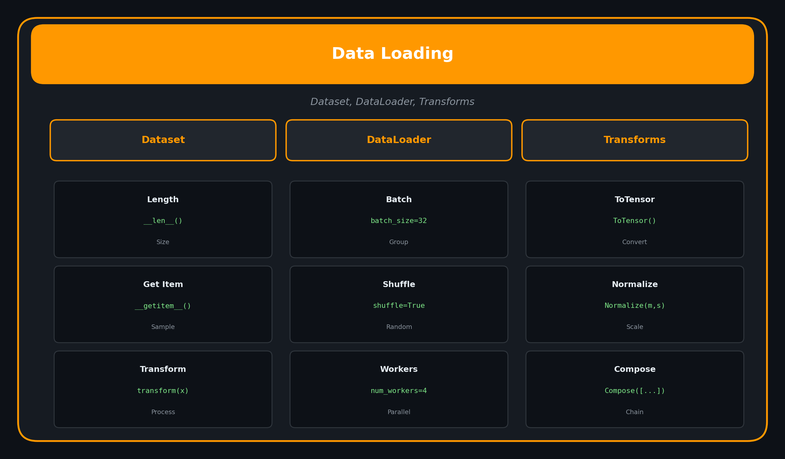

<p align="center">
  
  
  
</p>

<h1 align="center">05. Data Loading</h1>

<p align="center">
  <a href="../README.md">← Back</a> •
  <a href="../04_neural_networks/README.md">← Prev</a> •
  <a href="../06_training_loop/README.md">Next: Training Loop →</a>
</p>

<p align="center">
  <a href="https://colab.research.google.com/github/gaurav-redhat/pytorch_tutorial/blob/main/05_data_loading/demo.ipynb">
    
  </a>
</p>

---

<p align="center">
  
</p>

---

## 🎯 What You'll Learn

| Topic | Description |
|-------|-------------|
| Dataset | Custom data container |
| DataLoader | Batching and shuffling |
| Transforms | Data augmentation |
| Built-in | MNIST, CIFAR, ImageNet |

---

## 📦 Custom Dataset

```python
from torch.utils.data import Dataset, DataLoader

class CustomDataset(Dataset):
    def __init__(self, data, labels, transform=None):
        self.data = data
        self.labels = labels
        self.transform = transform
    
    def __len__(self):
        return len(self.data)
    
    def __getitem__(self, idx):
        x = self.data[idx]
        y = self.labels[idx]
        
        if self.transform:
            x = self.transform(x)
        
        return x, y
```

---

## 🔄 DataLoader

```python
dataset = CustomDataset(data, labels)

# Create DataLoader
loader = DataLoader(
    dataset,
    batch_size=32,      # Samples per batch
    shuffle=True,       # Randomize order
    num_workers=4,      # Parallel loading
    pin_memory=True     # Faster GPU transfer
)

# Iterate
for batch_x, batch_y in loader:
    # batch_x: [32, ...]
    # batch_y: [32]
    pass
```

---

## 🎨 Transforms

```python
from torchvision import transforms

# Compose multiple transforms
transform = transforms.Compose([
    transforms.Resize(256),
    transforms.CenterCrop(224),
    transforms.ToTensor(),
    transforms.Normalize(
        mean=[0.485, 0.456, 0.406],
        std=[0.229, 0.224, 0.225]
    )
])

# For training (with augmentation)
train_transform = transforms.Compose([
    transforms.RandomResizedCrop(224),
    transforms.RandomHorizontalFlip(),
    transforms.ToTensor(),
    transforms.Normalize(mean, std)
])
```

---

## 📚 Built-in Datasets

```python
from torchvision import datasets

# MNIST
mnist = datasets.MNIST(
    root='./data',
    train=True,
    download=True,
    transform=transforms.ToTensor()
)

# CIFAR-10
cifar = datasets.CIFAR10(
    root='./data',
    train=True,
    download=True,
    transform=transform
)

# ImageFolder (your own images)
# Structure: root/class1/*.jpg, root/class2/*.jpg
dataset = datasets.ImageFolder(
    root='./my_data',
    transform=transform
)
```

---

## 🔀 Train/Val Split

```python
from torch.utils.data import random_split

# Split dataset
train_size = int(0.8 * len(dataset))
val_size = len(dataset) - train_size

train_dataset, val_dataset = random_split(
    dataset, [train_size, val_size]
)

# Create loaders
train_loader = DataLoader(train_dataset, batch_size=32, shuffle=True)
val_loader = DataLoader(val_dataset, batch_size=32, shuffle=False)
```

---

## ✅ Checklist

- [ ] Create custom Dataset class
- [ ] Use DataLoader for batching
- [ ] Apply transforms
- [ ] Use built-in datasets
- [ ] Split train/val

---

<p align="center">
  <a href="https://colab.research.google.com/github/gaurav-redhat/pytorch_tutorial/blob/main/05_data_loading/demo.ipynb">
    
  </a>
</p>

