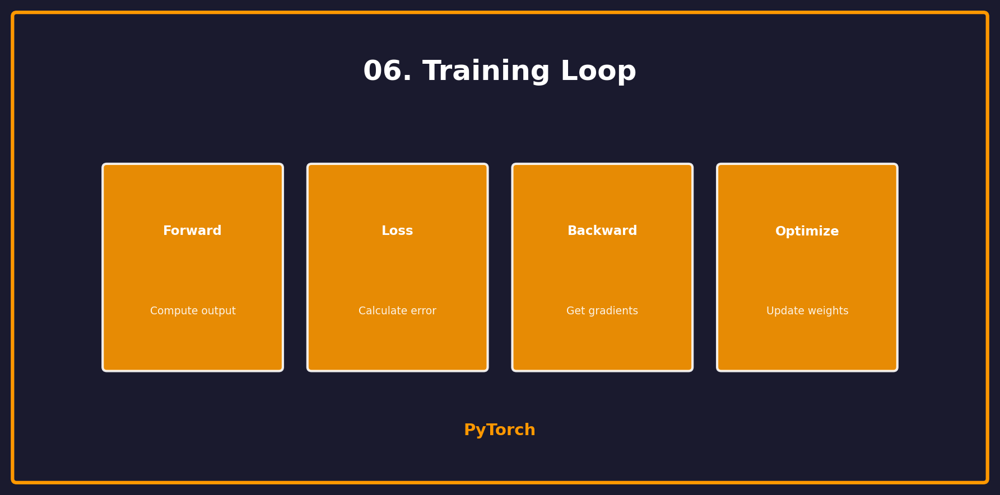

<p align="center">
  
  
  
</p>

<h1 align="center">06. Training Loop</h1>

<p align="center">
  <a href="../README.md">← Back</a> •
  <a href="../05_data_loading/README.md">← Prev</a> •
  <a href="../07_cnn/README.md">Next: CNNs →</a>
</p>

<p align="center">
  <a href="https://colab.research.google.com/github/gaurav-redhat/pytorch_tutorial/blob/main/06_training_loop/demo.ipynb">
    
  </a>
</p>

---

<p align="center">
  
</p>

---

## 🎯 What You'll Learn

| Topic | Description |
|-------|-------------|
| Forward Pass | Compute predictions |
| Loss | Calculate error |
| Backward | Compute gradients |
| Optimize | Update weights |

---

## 🔄 The Training Loop

```
┌─────────────────────────────────────────┐
│  for epoch in range(epochs):            │
│      for batch in dataloader:           │
│          ┌──────────────────────────┐   │
│          │ 1. Forward:  y = model(x)│   │
│          │ 2. Loss:     L = loss(y) │   │
│          │ 3. Backward: L.backward()│   │
│          │ 4. Update:   optim.step()│   │
│          └──────────────────────────┘   │
└─────────────────────────────────────────┘
```

---

## 🔥 Complete Training Code

```python
import torch
import torch.nn as nn
import torch.optim as optim

# Setup
model = MyModel()
criterion = nn.CrossEntropyLoss()
optimizer = optim.Adam(model.parameters(), lr=0.001)

# Training loop
for epoch in range(num_epochs):
    model.train()  # Training mode
    
    for batch_x, batch_y in train_loader:
        # 1. Zero gradients
        optimizer.zero_grad()
        
        # 2. Forward pass
        outputs = model(batch_x)
        
        # 3. Compute loss
        loss = criterion(outputs, batch_y)
        
        # 4. Backward pass
        loss.backward()
        
        # 5. Update weights
        optimizer.step()
    
    print(f"Epoch {epoch+1}, Loss: {loss.item():.4f}")
```

---

## 📊 Loss Functions

| Task | Loss Function |
|------|---------------|
| Classification | `nn.CrossEntropyLoss()` |
| Binary | `nn.BCEWithLogitsLoss()` |
| Regression | `nn.MSELoss()` |
| Regression (robust) | `nn.L1Loss()` |

---

## ⚡ Optimizers

```python
# SGD
optimizer = optim.SGD(model.parameters(), lr=0.01, momentum=0.9)

# Adam (most popular)
optimizer = optim.Adam(model.parameters(), lr=0.001)

# AdamW (with weight decay)
optimizer = optim.AdamW(model.parameters(), lr=0.001, weight_decay=0.01)
```

---

## 📈 Validation

```python
def validate(model, val_loader, criterion):
    model.eval()  # Evaluation mode
    total_loss = 0
    correct = 0
    
    with torch.no_grad():  # No gradient computation
        for x, y in val_loader:
            outputs = model(x)
            loss = criterion(outputs, y)
            total_loss += loss.item()
            
            # Accuracy
            _, predicted = outputs.max(1)
            correct += (predicted == y).sum().item()
    
    avg_loss = total_loss / len(val_loader)
    accuracy = correct / len(val_loader.dataset)
    return avg_loss, accuracy
```

---

## 💾 Checkpointing

```python
# Save checkpoint
torch.save({
    'epoch': epoch,
    'model_state_dict': model.state_dict(),
    'optimizer_state_dict': optimizer.state_dict(),
    'loss': loss,
}, 'checkpoint.pth')

# Load checkpoint
checkpoint = torch.load('checkpoint.pth')
model.load_state_dict(checkpoint['model_state_dict'])
optimizer.load_state_dict(checkpoint['optimizer_state_dict'])
```

---

## ✅ Checklist

- [ ] Set up model, loss, optimizer
- [ ] Write training loop
- [ ] Add validation
- [ ] Save/load checkpoints
- [ ] Track metrics

---

<p align="center">
  <a href="https://colab.research.google.com/github/gaurav-redhat/pytorch_tutorial/blob/main/06_training_loop/demo.ipynb">
    
  </a>
</p>

