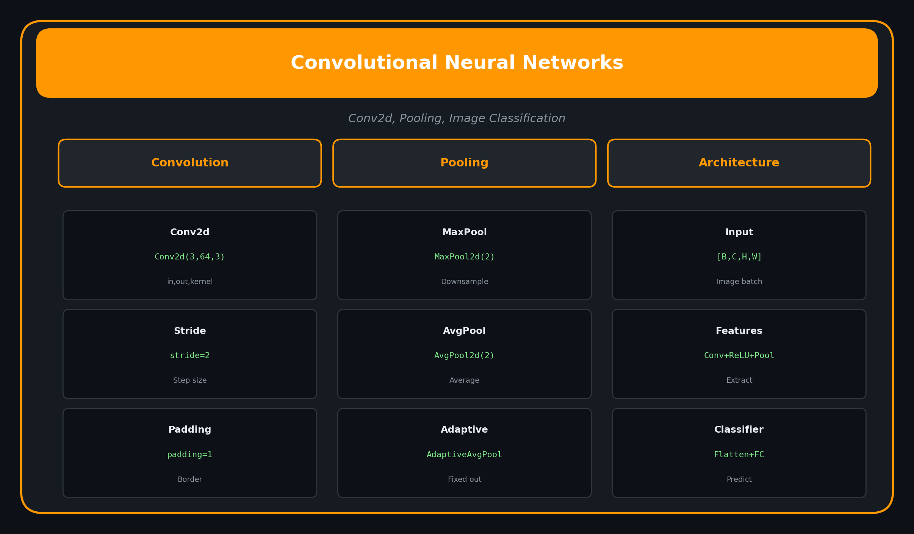

<p align="center">
  
  
  
</p>

<h1 align="center">07. Convolutional Neural Networks</h1>

<p align="center">
  <a href="../README.md">← Back</a> •
  <a href="../06_training_loop/README.md">← Prev</a> •
  <a href="../08_rnn_lstm/README.md">Next: RNNs →</a>
</p>

<p align="center">
  <a href="https://colab.research.google.com/github/gaurav-redhat/pytorch_tutorial/blob/main/07_cnn/demo.ipynb">
    
  </a>
</p>

---

<p align="center">
  
</p>

---

## 🎯 What You'll Learn

| Topic | Description |
|-------|-------------|
| Conv2d | Feature extraction |
| Pooling | Downsampling |
| Architecture | Build a CNN |
| CIFAR-10 | Image classification |

---

## 🏗️ CNN Architecture

```
Input [3, 32, 32]
    ↓
Conv2d + ReLU + Pool  →  [32, 16, 16]
    ↓
Conv2d + ReLU + Pool  →  [64, 8, 8]
    ↓
Conv2d + ReLU + Pool  →  [128, 4, 4]
    ↓
Flatten  →  [2048]
    ↓
Linear + ReLU  →  [512]
    ↓
Linear  →  [10] (classes)
```

---

## 🔥 Building a CNN

```python
import torch.nn as nn

class CNN(nn.Module):
    def __init__(self, num_classes=10):
        super().__init__()
        
        # Convolutional layers
        self.conv_layers = nn.Sequential(
            # Conv block 1
            nn.Conv2d(3, 32, kernel_size=3, padding=1),
            nn.BatchNorm2d(32),
            nn.ReLU(),
            nn.MaxPool2d(2),
            
            # Conv block 2
            nn.Conv2d(32, 64, kernel_size=3, padding=1),
            nn.BatchNorm2d(64),
            nn.ReLU(),
            nn.MaxPool2d(2),
            
            # Conv block 3
            nn.Conv2d(64, 128, kernel_size=3, padding=1),
            nn.BatchNorm2d(128),
            nn.ReLU(),
            nn.MaxPool2d(2),
        )
        
        # Fully connected layers
        self.fc_layers = nn.Sequential(
            nn.Flatten(),
            nn.Linear(128 * 4 * 4, 512),
            nn.ReLU(),
            nn.Dropout(0.5),
            nn.Linear(512, num_classes)
        )
    
    def forward(self, x):
        x = self.conv_layers(x)
        x = self.fc_layers(x)
        return x
```

---

## 📐 Conv2d Explained

```python
nn.Conv2d(
    in_channels=3,     # RGB image
    out_channels=32,   # Number of filters
    kernel_size=3,     # 3x3 filter
    stride=1,          # Step size
    padding=1          # Same output size
)
```

**Output size formula:**
```
out = (in + 2*padding - kernel_size) / stride + 1
```

---

## 🔽 Pooling

```python
# Max pooling (most common)
nn.MaxPool2d(kernel_size=2, stride=2)
# Reduces size by half

# Average pooling
nn.AvgPool2d(kernel_size=2, stride=2)

# Adaptive (output size guaranteed)
nn.AdaptiveAvgPool2d((1, 1))
```

---

## 📊 Training on CIFAR-10

```python
from torchvision import datasets, transforms

# Data
transform = transforms.Compose([
    transforms.RandomHorizontalFlip(),
    transforms.RandomCrop(32, padding=4),
    transforms.ToTensor(),
    transforms.Normalize((0.5, 0.5, 0.5), (0.5, 0.5, 0.5))
])

train_data = datasets.CIFAR10('./data', train=True, 
                               download=True, transform=transform)
train_loader = DataLoader(train_data, batch_size=64, shuffle=True)

# Model
model = CNN(num_classes=10)
criterion = nn.CrossEntropyLoss()
optimizer = optim.Adam(model.parameters(), lr=0.001)

# Train!
```

---

## ✅ Checklist

- [ ] Understand Conv2d parameters
- [ ] Use pooling to reduce size
- [ ] Build a CNN from scratch
- [ ] Train on CIFAR-10
- [ ] Achieve >80% accuracy

---

<p align="center">
  <a href="https://colab.research.google.com/github/gaurav-redhat/pytorch_tutorial/blob/main/07_cnn/demo.ipynb">
    
  </a>
</p>

---

<p align="center">
  <a href="../06_training_loop/README.md">← Prev: Training Loop</a> •
  <a href="../README.md">Back to Main</a> •
  <a href="../08_rnn_lstm/README.md">Next: RNNs & LSTMs →</a>
</p>

