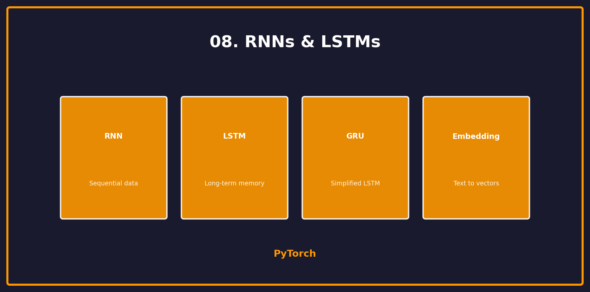

<p align="center">
  
  
  
</p>

<h1 align="center">08. RNNs & LSTMs</h1>

<p align="center">
  <a href="../README.md">← Back</a> •
  <a href="../07_cnn/README.md">← Prev</a> •
  <a href="../09_transformers/README.md">Next: Transformers →</a>
</p>

<p align="center">
  <a href="https://colab.research.google.com/github/gaurav-redhat/pytorch_tutorial/blob/main/08_rnn_lstm/demo.ipynb">
    
  </a>
</p>

---

<p align="center">
  
</p>

---

## 🎯 What You'll Learn

| Topic | Description |
|-------|-------------|
| RNN | Basic recurrent network |
| LSTM | Long Short-Term Memory |
| GRU | Gated Recurrent Unit |
| Text | Sequence modeling |

---

## 🔄 RNN Concept

```
x₁ → [RNN] → h₁ → [RNN] → h₂ → [RNN] → h₃ → output
       ↑           ↑           ↑
      h₀          h₁          h₂
```

Each step gets input **and** previous hidden state.

---

## 🔥 LSTM in PyTorch

```python
import torch.nn as nn

class LSTMModel(nn.Module):
    def __init__(self, vocab_size, embed_dim, hidden_dim, num_layers):
        super().__init__()
        
        self.embedding = nn.Embedding(vocab_size, embed_dim)
        
        self.lstm = nn.LSTM(
            input_size=embed_dim,
            hidden_size=hidden_dim,
            num_layers=num_layers,
            batch_first=True,     # Input: [batch, seq, features]
            dropout=0.2,
            bidirectional=False
        )
        
        self.fc = nn.Linear(hidden_dim, vocab_size)
    
    def forward(self, x, hidden=None):
        # x: [batch, seq_len]
        embed = self.embedding(x)  # [batch, seq_len, embed_dim]
        
        # LSTM
        output, (h_n, c_n) = self.lstm(embed, hidden)
        # output: [batch, seq_len, hidden_dim]
        
        # Predict
        logits = self.fc(output)  # [batch, seq_len, vocab_size]
        return logits, (h_n, c_n)
```

---

## 📊 RNN vs LSTM vs GRU

| Type | Gates | Memory | Speed |
|------|:-----:|:------:|:-----:|
| RNN | 0 | Short | Fast |
| LSTM | 3 | Long | Slow |
| GRU | 2 | Long | Medium |

---

## 📝 Text Generation Example

```python
# Sample from model
def generate(model, start_text, length=100, temperature=1.0):
    model.eval()
    hidden = None
    
    # Encode start text
    input_ids = encode(start_text)
    generated = list(input_ids)
    
    with torch.no_grad():
        for _ in range(length):
            x = torch.tensor([input_ids[-1]]).unsqueeze(0)
            logits, hidden = model(x, hidden)
            
            # Sample next token
            probs = F.softmax(logits[0, -1] / temperature, dim=-1)
            next_id = torch.multinomial(probs, 1).item()
            
            generated.append(next_id)
            input_ids = [next_id]
    
    return decode(generated)
```

---

## 🎯 Bidirectional LSTM

```python
self.lstm = nn.LSTM(
    input_size=embed_dim,
    hidden_size=hidden_dim,
    bidirectional=True  # Forward + backward
)

# Output size doubles!
# output: [batch, seq_len, hidden_dim * 2]
```

---

## ⚠️ Common Issues

| Problem | Solution |
|---------|----------|
| Vanishing gradients | Use LSTM/GRU |
| Slow training | Use bidirectional |
| Overfitting | Add dropout |
| Long sequences | Use Transformer |

---

## ✅ Checklist

- [ ] Understand RNN concept
- [ ] Use LSTM for sequences
- [ ] Handle hidden states
- [ ] Generate text
- [ ] Try bidirectional

---

<p align="center">
  <a href="https://colab.research.google.com/github/gaurav-redhat/pytorch_tutorial/blob/main/08_rnn_lstm/demo.ipynb">
    
  </a>
</p>

