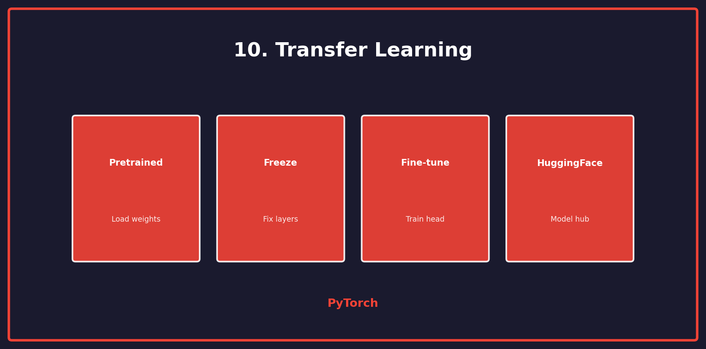

<p align="center">
  
  
  
</p>

<h1 align="center">10. Transfer Learning</h1>

<p align="center">
  <a href="../README.md">← Back</a> •
  <a href="../09_transformers/README.md">← Prev</a> •
  <a href="../11_gan/README.md">Next: GANs →</a>
</p>

<p align="center">
  <a href="https://colab.research.google.com/github/gaurav-redhat/pytorch_tutorial/blob/main/10_transfer_learning/demo.ipynb">
    
  </a>
</p>

---

<p align="center">
  
</p>

---

## 🎯 What You'll Learn

| Topic | Description |
|-------|-------------|
| Pretrained | Load pretrained weights |
| Freeze | Fix backbone layers |
| Fine-tune | Train classifier head |
| HuggingFace | Use model hub |

---

## 💡 The Idea

```
ImageNet Model (1000 classes)
         ↓
    [Backbone]  ← Pretrained, freeze
         ↓
   [New Head]   ← Train on your data
         ↓
  Your Task (10 classes)
```

---

## 🔥 Fine-tune ResNet

```python
import torchvision.models as models

# Load pretrained ResNet
model = models.resnet50(weights='IMAGENET1K_V2')

# Freeze backbone
for param in model.parameters():
    param.requires_grad = False

# Replace classifier
num_classes = 10
model.fc = nn.Sequential(
    nn.Linear(2048, 512),
    nn.ReLU(),
    nn.Dropout(0.3),
    nn.Linear(512, num_classes)
)

# Only train the new head
optimizer = optim.Adam(model.fc.parameters(), lr=0.001)
```

---

## 🔓 Gradual Unfreezing

```python
# Stage 1: Train head only
for param in model.parameters():
    param.requires_grad = False
for param in model.fc.parameters():
    param.requires_grad = True
# Train...

# Stage 2: Unfreeze last layer
for param in model.layer4.parameters():
    param.requires_grad = True
# Train with lower LR...

# Stage 3: Unfreeze everything
for param in model.parameters():
    param.requires_grad = True
# Train with very low LR...
```

---

## 🤗 HuggingFace Transformers

```python
from transformers import AutoModel, AutoTokenizer

# Load pretrained BERT
tokenizer = AutoTokenizer.from_pretrained('bert-base-uncased')
model = AutoModel.from_pretrained('bert-base-uncased')

# Add classification head
class BertClassifier(nn.Module):
    def __init__(self, num_classes):
        super().__init__()
        self.bert = AutoModel.from_pretrained('bert-base-uncased')
        self.classifier = nn.Linear(768, num_classes)
        
        # Freeze BERT
        for param in self.bert.parameters():
            param.requires_grad = False
    
    def forward(self, input_ids, attention_mask):
        outputs = self.bert(input_ids, attention_mask)
        pooled = outputs.last_hidden_state[:, 0]  # [CLS] token
        return self.classifier(pooled)
```

---

## 📊 Available Models

| Vision | NLP |
|--------|-----|
| ResNet | BERT |
| VGG | GPT-2 |
| EfficientNet | RoBERTa |
| ViT | T5 |

```python
# Vision models
models.resnet50(weights='IMAGENET1K_V2')
models.efficientnet_b0(weights='IMAGENET1K_V1')
models.vit_b_16(weights='IMAGENET1K_V1')
```

---

## ⚡ Tips

| Tip | Why |
|-----|-----|
| Lower LR for pretrained | Already good weights |
| Data augmentation | Prevent overfitting |
| Normalize properly | Match pretraining |
| Start frozen | Preserve features |

---

## ✅ Checklist

- [ ] Load pretrained model
- [ ] Freeze backbone
- [ ] Replace head
- [ ] Fine-tune on your data
- [ ] Try gradual unfreezing

---

<p align="center">
  <a href="https://colab.research.google.com/github/gaurav-redhat/pytorch_tutorial/blob/main/10_transfer_learning/demo.ipynb">
    
  </a>
</p>

