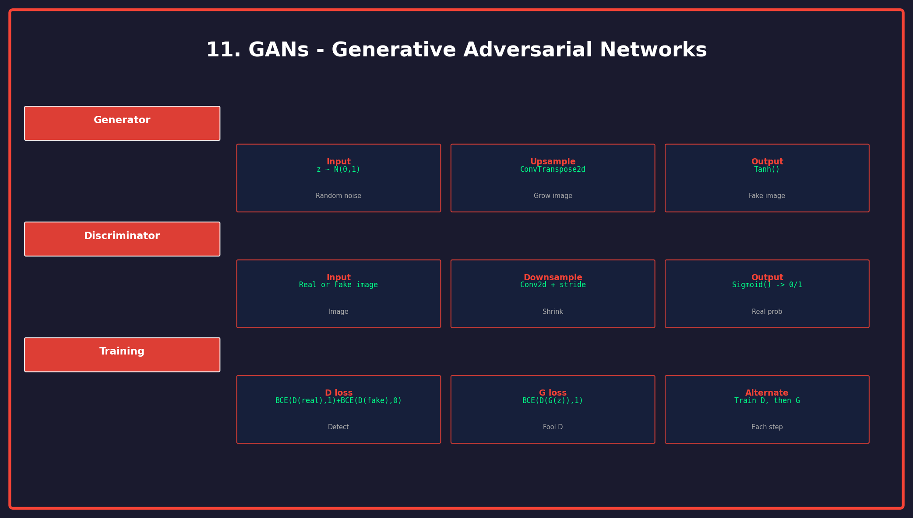

<p align="center">
  
  
  
</p>

<h1 align="center">11. Generative Adversarial Networks</h1>

<p align="center">
  <a href="../README.md">← Back</a> •
  <a href="../10_transfer_learning/README.md">← Prev</a> •
  <a href="../12_deployment/README.md">Next: Deployment →</a>
</p>

<p align="center">
  <a href="https://colab.research.google.com/github/gaurav-redhat/pytorch_tutorial/blob/main/11_gan/demo.ipynb">
    
  </a>
</p>

---

<p align="center">
  
</p>

---

## 🎯 What You'll Learn

| Topic | Description |
|-------|-------------|
| Generator | Create fake data |
| Discriminator | Detect fake vs real |
| Training | Adversarial game |
| DCGAN | Deep Convolutional GAN |

---

## 🎮 The Adversarial Game

```
Generator (G): "Create fakes that fool D"
         ↓
    [Fake Images]
         ↓
Discriminator (D): "Detect real vs fake"
         ↓
    Real: 1, Fake: 0
```

Both networks compete and improve together!

---

## 🔥 Generator

```python
class Generator(nn.Module):
    def __init__(self, latent_dim=100, img_channels=1):
        super().__init__()
        
        self.main = nn.Sequential(
            # latent_dim → 256 × 4 × 4
            nn.ConvTranspose2d(latent_dim, 256, 4, 1, 0, bias=False),
            nn.BatchNorm2d(256),
            nn.ReLU(True),
            
            # 256 → 128 × 8 × 8
            nn.ConvTranspose2d(256, 128, 4, 2, 1, bias=False),
            nn.BatchNorm2d(128),
            nn.ReLU(True),
            
            # 128 → 64 × 16 × 16
            nn.ConvTranspose2d(128, 64, 4, 2, 1, bias=False),
            nn.BatchNorm2d(64),
            nn.ReLU(True),
            
            # 64 → 1 × 32 × 32
            nn.ConvTranspose2d(64, img_channels, 4, 2, 1, bias=False),
            nn.Tanh()  # Output [-1, 1]
        )
    
    def forward(self, z):
        return self.main(z.view(-1, z.size(1), 1, 1))
```

---

## 🔍 Discriminator

```python
class Discriminator(nn.Module):
    def __init__(self, img_channels=1):
        super().__init__()
        
        self.main = nn.Sequential(
            # 1 × 32 × 32 → 64 × 16 × 16
            nn.Conv2d(img_channels, 64, 4, 2, 1, bias=False),
            nn.LeakyReLU(0.2, inplace=True),
            
            # 64 → 128 × 8 × 8
            nn.Conv2d(64, 128, 4, 2, 1, bias=False),
            nn.BatchNorm2d(128),
            nn.LeakyReLU(0.2, inplace=True),
            
            # 128 → 256 × 4 × 4
            nn.Conv2d(128, 256, 4, 2, 1, bias=False),
            nn.BatchNorm2d(256),
            nn.LeakyReLU(0.2, inplace=True),
            
            # 256 × 4 × 4 → 1
            nn.Conv2d(256, 1, 4, 1, 0, bias=False),
            nn.Sigmoid()
        )
    
    def forward(self, x):
        return self.main(x).view(-1)
```

---

## 🔄 Training Loop

```python
criterion = nn.BCELoss()
optim_G = optim.Adam(G.parameters(), lr=0.0002, betas=(0.5, 0.999))
optim_D = optim.Adam(D.parameters(), lr=0.0002, betas=(0.5, 0.999))

for epoch in range(epochs):
    for real_images, _ in dataloader:
        batch_size = real_images.size(0)
        real_label = torch.ones(batch_size)
        fake_label = torch.zeros(batch_size)
        
        # ============ Train Discriminator ============
        optim_D.zero_grad()
        
        # Real images
        output_real = D(real_images)
        loss_real = criterion(output_real, real_label)
        
        # Fake images
        z = torch.randn(batch_size, latent_dim)
        fake_images = G(z)
        output_fake = D(fake_images.detach())
        loss_fake = criterion(output_fake, fake_label)
        
        loss_D = loss_real + loss_fake
        loss_D.backward()
        optim_D.step()
        
        # ============ Train Generator ============
        optim_G.zero_grad()
        
        output = D(fake_images)
        loss_G = criterion(output, real_label)  # Fool D!
        
        loss_G.backward()
        optim_G.step()
```

---

## 💡 Tips for Training

| Tip | Why |
|-----|-----|
| Use LeakyReLU in D | Better gradients |
| BatchNorm everywhere | Stabilize training |
| Label smoothing | Prevent D dominance |
| Check both losses | Should oscillate |

---

## ✅ Checklist

- [ ] Build Generator
- [ ] Build Discriminator
- [ ] Implement training loop
- [ ] Generate images
- [ ] Save samples during training

---

<p align="center">
  <a href="https://colab.research.google.com/github/gaurav-redhat/pytorch_tutorial/blob/main/11_gan/demo.ipynb">
    
  </a>
</p>

---

<p align="center">
  <a href="../10_transfer_learning/README.md">← Prev: Transfer Learning</a> •
  <a href="../README.md">Back to Main</a> •
  <a href="../12_deployment/README.md">Next: Deployment →</a>
</p>

