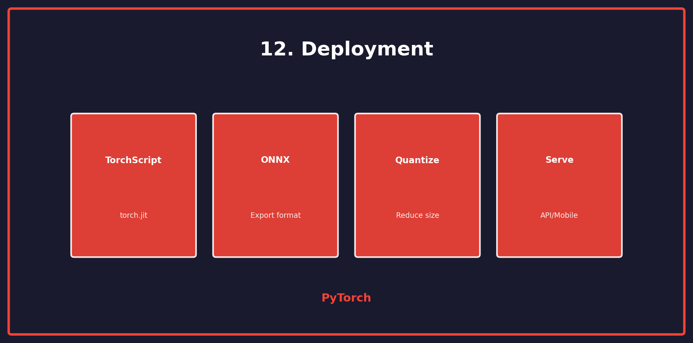

<p align="center">
  
  
  
</p>

<h1 align="center">12. Deployment</h1>

<p align="center">
  <a href="../README.md">← Back</a> •
  <a href="../11_gan/README.md">← Prev</a>
</p>

<p align="center">
  <a href="https://colab.research.google.com/github/gaurav-redhat/pytorch_tutorial/blob/main/12_deployment/demo.ipynb">
    
  </a>
</p>

---

<p align="center">
  
</p>

---

## 🎯 What You'll Learn

| Topic | Description |
|-------|-------------|
| TorchScript | JIT compilation |
| ONNX | Export format |
| Quantization | Reduce model size |
| Serving | Deploy as API |

---

## 📦 TorchScript

```python
# Method 1: Tracing (for simple models)
example_input = torch.randn(1, 3, 224, 224)
traced_model = torch.jit.trace(model, example_input)
traced_model.save('model_traced.pt')

# Method 2: Scripting (for complex control flow)
scripted_model = torch.jit.script(model)
scripted_model.save('model_scripted.pt')

# Load and use
loaded = torch.jit.load('model_traced.pt')
output = loaded(input_tensor)
```

---

## 🔄 ONNX Export

```python
import torch.onnx

# Export to ONNX
dummy_input = torch.randn(1, 3, 224, 224)
torch.onnx.export(
    model,
    dummy_input,
    'model.onnx',
    input_names=['input'],
    output_names=['output'],
    dynamic_axes={
        'input': {0: 'batch_size'},
        'output': {0: 'batch_size'}
    }
)

# Use with ONNX Runtime
import onnxruntime as ort

session = ort.InferenceSession('model.onnx')
output = session.run(None, {'input': input_numpy})
```

---

## ⚡ Quantization

```python
# Dynamic quantization (easiest)
quantized_model = torch.quantization.quantize_dynamic(
    model,
    {nn.Linear},  # Layers to quantize
    dtype=torch.qint8
)

# Static quantization (better performance)
model.qconfig = torch.quantization.get_default_qconfig('fbgemm')
torch.quantization.prepare(model, inplace=True)

# Calibrate with representative data
for data, _ in calibration_loader:
    model(data)

torch.quantization.convert(model, inplace=True)
```

---

## 📊 Size Comparison

| Model | Size | Inference |
|-------|:----:|:---------:|
| FP32 | 100 MB | 1x |
| INT8 | 25 MB | 2-4x faster |
| FP16 | 50 MB | 1.5x faster |

---

## 🌐 Serve as API

```python
from flask import Flask, request, jsonify
import torch

app = Flask(__name__)
model = torch.jit.load('model.pt')
model.eval()

@app.route('/predict', methods=['POST'])
def predict():
    data = request.json['data']
    tensor = torch.tensor(data)
    
    with torch.no_grad():
        output = model(tensor)
        prediction = output.argmax(dim=1).tolist()
    
    return jsonify({'prediction': prediction})

if __name__ == '__main__':
    app.run(host='0.0.0.0', port=5000)
```

---

## 📱 Mobile Deployment

```python
# Optimize for mobile
from torch.utils.mobile_optimizer import optimize_for_mobile

scripted = torch.jit.script(model)
optimized = optimize_for_mobile(scripted)
optimized._save_for_lite_interpreter('model_mobile.ptl')
```

---

## 🐳 Docker

```dockerfile
FROM python:3.9-slim

WORKDIR /app
COPY requirements.txt .
RUN pip install -r requirements.txt

COPY model.pt .
COPY app.py .

EXPOSE 5000
CMD ["python", "app.py"]
```

---

## ✅ Deployment Checklist

- [ ] Export with TorchScript
- [ ] Convert to ONNX (if needed)
- [ ] Apply quantization
- [ ] Test inference speed
- [ ] Wrap in API
- [ ] Containerize

---

<p align="center">
  <a href="https://colab.research.google.com/github/gaurav-redhat/pytorch_tutorial/blob/main/12_deployment/demo.ipynb">
    
  </a>
</p>

