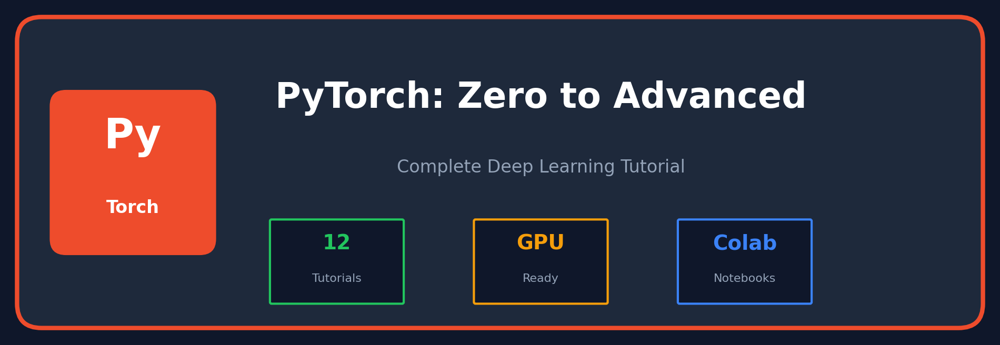

<p align="center">
  
</p>

<h1 align="center">🔥 PyTorch: Zero to Advanced</h1>

<p align="center">
  
  
  
</p>

<p align="center">
  <b>Complete PyTorch tutorial series with runnable Colab notebooks.</b><br/>
  No local setup needed — click and start learning!
</p>

---

## 📚 Tutorials

### 🟢 Beginner

| # | Topic | Description | Colab |
|:--:|-------|-------------|:-----:|
| 01 | [**Basics**](./01_basics/) | Install PyTorch, first tensor, GPU check | [](https://colab.research.google.com/github/gaurav-redhat/pytorch_tutorial/blob/main/01_basics/demo.ipynb) |
| 02 | [**Tensors**](./02_tensors/) | Create, reshape, NumPy, linear algebra | [](https://colab.research.google.com/github/gaurav-redhat/pytorch_tutorial/blob/main/02_tensors/demo.ipynb) |
| 03 | [**Autograd**](./03_autograd/) | Automatic differentiation, gradients | [](https://colab.research.google.com/github/gaurav-redhat/pytorch_tutorial/blob/main/03_autograd/demo.ipynb) |
| 04 | [**Neural Networks**](./04_neural_networks/) | nn.Module, layers, activations | [](https://colab.research.google.com/github/gaurav-redhat/pytorch_tutorial/blob/main/04_neural_networks/demo.ipynb) |

### 🟡 Intermediate

| # | Topic | Description | Colab |
|:--:|-------|-------------|:-----:|
| 05 | [**Data Loading**](./05_data_loading/) | Dataset, DataLoader, transforms | [](https://colab.research.google.com/github/gaurav-redhat/pytorch_tutorial/blob/main/05_data_loading/demo.ipynb) |
| 06 | [**Training Loop**](./06_training_loop/) | Forward, backward, optimize | [](https://colab.research.google.com/github/gaurav-redhat/pytorch_tutorial/blob/main/06_training_loop/demo.ipynb) |
| 07 | [**CNNs**](./07_cnn/) | Convolution, pooling, image classification | [](https://colab.research.google.com/github/gaurav-redhat/pytorch_tutorial/blob/main/07_cnn/demo.ipynb) |
| 08 | [**RNNs & LSTMs**](./08_rnn_lstm/) | Sequential data, time series | [](https://colab.research.google.com/github/gaurav-redhat/pytorch_tutorial/blob/main/08_rnn_lstm/demo.ipynb) |

### 🔴 Advanced

| # | Topic | Description | Colab |
|:--:|-------|-------------|:-----:|
| 09 | [**Transformers**](./09_transformers/) | Self-attention, multi-head attention | [](https://colab.research.google.com/github/gaurav-redhat/pytorch_tutorial/blob/main/09_transformers/demo.ipynb) |
| 10 | [**Transfer Learning**](./10_transfer_learning/) | Fine-tune pretrained models | [](https://colab.research.google.com/github/gaurav-redhat/pytorch_tutorial/blob/main/10_transfer_learning/demo.ipynb) |
| 11 | [**GANs**](./11_gan/) | Generator, discriminator, training | [](https://colab.research.google.com/github/gaurav-redhat/pytorch_tutorial/blob/main/11_gan/demo.ipynb) |
| 12 | [**Deployment**](./12_deployment/) | TorchScript, ONNX, quantization | [](https://colab.research.google.com/github/gaurav-redhat/pytorch_tutorial/blob/main/12_deployment/demo.ipynb) |

---

## 🚀 Quick Start

**Option 1: Colab (Recommended)**
- Click any **Open Colab** button above
- Free GPU, no setup needed

**Option 2: Local**
```bash
pip install torch torchvision
git clone https://github.com/gaurav-redhat/pytorch_tutorial.git
cd pytorch_tutorial
jupyter notebook
```

---

## 📊 Prerequisites

| Level | Requirements |
|-------|-------------|
| 🟢 Beginner | Basic Python |
| 🟡 Intermediate | Python classes, NumPy |
| 🔴 Advanced | Linear algebra, calculus |

---

## 📚 Resources

- [PyTorch Documentation](https://pytorch.org/docs/)
- [PyTorch Tutorials](https://pytorch.org/tutorials/)
- [Deep Learning Book](https://www.deeplearningbook.org/)

---

<p align="center">
  <b>MIT License</b> — Made with ❤️ for the PyTorch community
</p>
